# LPOO_70 - Frostbite Penguin Madness

O nosso jogo é inspirado no jogo `Gelo Fino` que existia no jogo *Club Penguin*. O jogador deve controlar o personagem de jogo através de inúmeros labirintos, passando pelo número máximo de quadrados antes de o completar. Além disso, ao longo do mapa vão surgindo moedas coletáveis que permitem ao jogador obter uma pontuação mais elevada, assim como diversos obstáculos!

- **Universidade**: [FEUP](https://sigarra.up.pt/feup/pt/web_page.Inicial)
- **Curso**: [MIEIC](https://sigarra.up.pt/feup/pt/cur_geral.cur_view?pv_curso_id=742&pv_ano_lectivo=2019)
- **Unidade Curricular**: [LPOO](https://sigarra.up.pt/feup/pt/UCURR_GERAL.FICHA_UC_VIEW?pv_ocorrencia_id=420000) (Laboratório de Programação Orientada por Objetos)
- **Elementos do Grupo**:    
    - Diogo Samuel Fernandes, up201806250@fe.up.pt
    - Hugo Guimarães, up201806490@fe.up.pt

# Indíce

1. [Funcionalidades do jogo](#funcionalidades-do-jogo)
    - [Funcionalidades Implementadas](#funcionalidades-implementadas)
    - [Funcionalidades Planeada](#funcionalidades-planeadas)
2. [Padrão Arquitetural do Código](#padrão-arquitetural-do-código)
3. [Design Patterns](#design-patterns)
    - [Level Builder](#level-builder)
    - [State](#state)
    - [Command](#command)
    - [Interact Strategy](#pufflebox-interact-strategy)
    - [Melting Strategy](#melt-strategy)
    - [Menu Factory](#menu-factory)
    - [Private Class Data](#private-class-data)
4. [Code Smells and Refactoring](#code-smells-and-refactoring)
    - [Data Class](#data-class)
    - [Large Class](#large-class)
    - [Switch Statements](#switch-statements)
5. [Unit Tests](#unit-tests)

# Funcionalidades do jogo
## Funcionalidades Implementadas

#### Menu

O nosso menu principal de jogo possui 3 opções distintas sendo elas:

- **Start** - Permite ao jogador começar um novo jogo.
- **Instructions** - Abre um menu em que o jogador pode observar todos os elementos do jogo.
- **Exit** - Faz com que a janela de jogo feche.

O jogador pode navegar entre as opções presentes no menu utilizando as teclas *ArrowUp* e *ArrowDown*. Para selecionar uma opção, o jogador terá de carregar na tecla *ArrowRight*.

Além disso, quando o jogador se encontra no menu, pode carregar na tecla *q* para fechar a janela de jogo.

#### Jogo

O jogador controla o Puffle utilizando as teclas direcionais. Além disso, o mesmo pode reiniciar o nível carregando na tecla *r* e passar para o nível seguinte pressionando a tecla *n*.
Caso o jogador queira terminar o jogo, pode carregar na tecla *q*.

Na parte superior do jogo, o jogador pode ver em que nível é que se encontra, assim como o número de blocos que é possível derreter. Já na parte inferior, é possível ver a sua pontuação total.

##### Elementos do jogo
Representam todos os obstáculos possíveis, encontrando-se espalhados pelos vários niveis. Todos ocupam um só bloco, têm a sua respetiva imagem, cor e uma determinada interação que os distingue entre eles.

Os elementos podem ser divididos em dois tipos diferentes, sendo estes:

- ##### Movable
    São os elementos que possuem algum tipo de movimento.
    - **Box** - Caixa que pode ser empurrada até colidir com um obstáculo. Não pode ser atravessada pelo jogador.
    - **Puffle** - Personagem principal, que é controlada pelo jogador.

- ##### Imovable
    Elementos que não possuem movimento.
    - **Coin** - Incrementa os pontos do jogador por dez.
    - **DoubleIce** - Bloco de gelo mais resistente que derrete ao interagir com o Puffle, tornando-se em gelo.
    - **Ice** - Bloco de gelo que derrete ao interagir com o Puffle, transformando-se em água. Por este motivo, o Puffle só pode passar por cada bloco de gelo uma única vez.
    -  **Water** - É criada sempre que o Puffle derrete gelo, não podendo ser atravessada.
    -  **Wall** - Não pode ser atravessada. Delimitam o nível, mantendo o Puffle numa região fechada.
    - **EmptyBlock** - Posição final onde a caixa deve ficar, de modo a que o jogador obtenha o número máximo de pontos. Por esse mesmo motivo, movimentar-se por cima destas peças não aumenta a pontuação do jogador.
    - **Finish** - Local onde o jogador deve chegar para completar o nível.
    - **Lock** - Não pode ser atravessada enquanto o jogador não coletar a chave.
    - **Key** - Abre a fechadura.
    - **InvisibleWall** - É idêntico a uma parede, mas pode ser atravessado, permitindo desbloquear o nível secreto.
    - **Secret** - Objeto com comportamento semelhante ao bloco de chegada (*Finish*). No entanto, este desbloqueia o nível secreto.
    - **Teleport** - Está sempre associado a outro Teleport. Teletransporta o Puffle ou a caixa entre a posição dos dois Teleports, sendo o seu uso bloqueado após a sua utilização por parte do Puffle.

#### Screenshots e Gameplay

| Menu                           | Instruções                         | Fim de Jogo                  |
| ------------------------------ | -----------------------------------| -----------------------------|
| 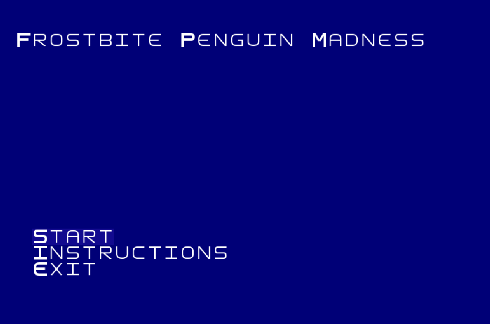 | 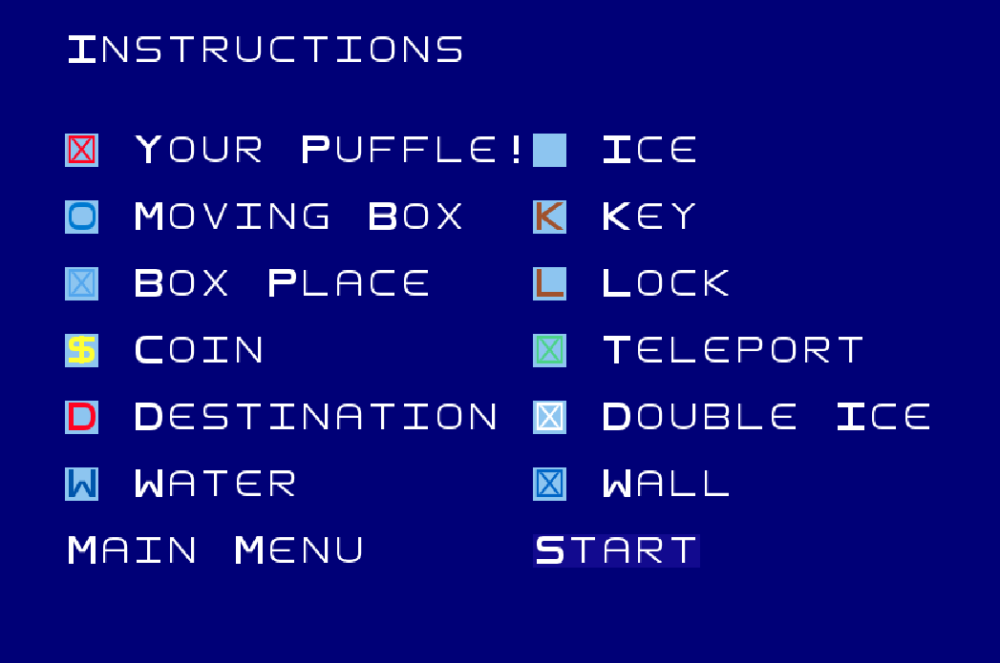 | 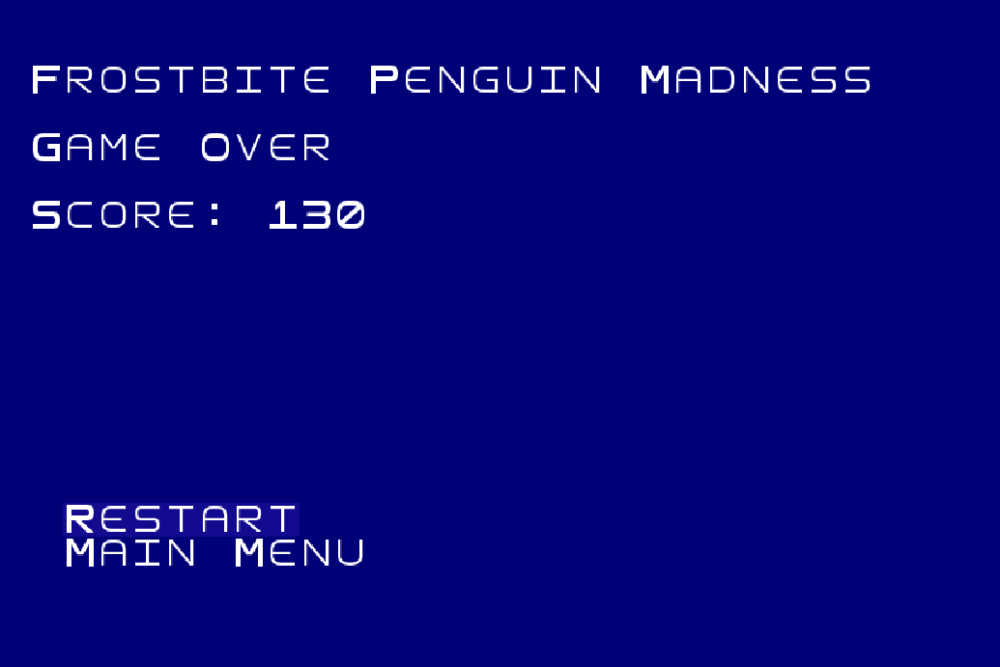 |

| Nível 1                       | Nível 19 (Passagem secreta oculta) |  Nível 19 (Passagem secreta descoberta) |
| ----------------------------- | ---------------------------------- | --------------------------------------- |
|   | 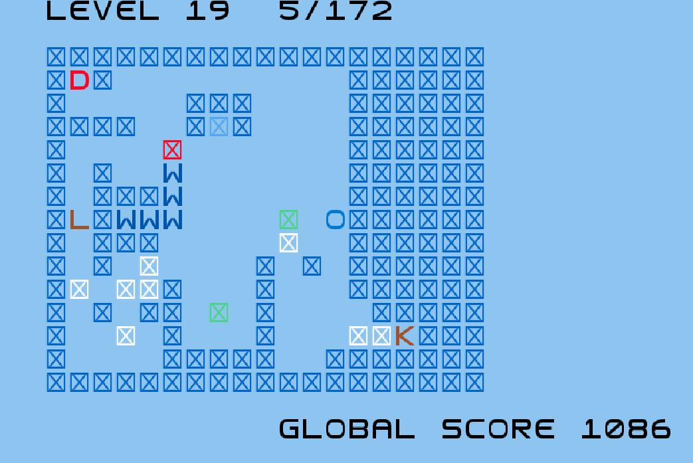 | 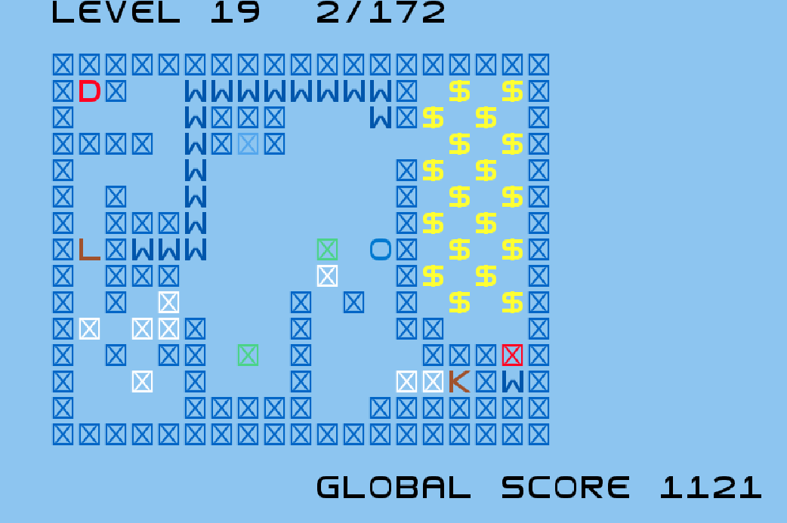 |

|Gameplay|
|---|
||

## Funcionalidades Planeadas

- [x] Menu Principal
    - [x] Começar um novo jogo
    - [x] Instruções do jogo
    - [ ] Escolha de nível
    - [x] Sair do jogo

- [x] Movimento
    - [x] Sempre que o Puffle se movimenta, a sua posição anterior é alterada conforme o tipo de bloco
    - [x] As posições que o Puffle torna inacessível ao movimentar são transformadas em água
    - [x] Quando o jogador não se pode movimentar, isto é, quando rodeado por peças de água e por paredes, perde o jogo

- [ ] Menu Pausa
    - [x] Recomeçar o nível
    - [x] Terminar o jogo
    - [ ] Retornar ao menu principal

- [x] Pontuação
    - [x] Sempre que o jogador se movimenta para um bloco normal, a sua pontuação incrementa um ponto
    - [x] Existem moedas espalhadas em determinados niveís
    - [x] Capturar uma moeda aumenta a pontuação do jogador em dez pontos

- [x] Mecânicas de jogo
    - [x] Quadrados onde o jogador pode passar por cima duas vezes.
    - [x] Mecanismo chave-fechadura. Só é possível atravessar a fechadura caso se tenha obtido a chave.
    - [x] Quadrados verdes que correspondem a uma zona de teletransporte. Quando o jogador passa por cima do mesmo, vai ser teletransportado para outro quadrado verde do mesmo nível. Depois de ser utilizado pelo Puffle, o teletransporte fica desativado.
    - [x] Existência de peças de jogo que são empurradas pelo jogador até colidirem com uma parede. Estas peças podem utilizar os quadrados de teletransporte.
    - [x] Passagem secreta que leva o jogador para uma zona bónus com muitos sacos de moedas.

- [x] Menu de fim de jogo
    - [x] O jogo acaba assim que o jogador completar todos os niveis ou perder. É apresentada a pontuação total.
    - [x] Recomeçar o jogo
    - [x] Retornar ao Menu Principal

# Padrão Arquitetural do Código

Para a realização deste projeto, decidimos separar e estruturar o nosso código utilizando o MVC. Este modelo foi apresentado durante as aulas e consiste em separar o código em três *packages* diferentes, sendo estes:

- O ***Model***, que representa toda a informação presente no jogo.
- O ***View***, que é responsável pela visualização do jogo e por enviar a informação recebida do utilizador, como por exemplo, teclas pressionadas no teclado, para o *Controller*.
- O ***Controller***, que processa a informação recebida pelo *View* e envia comandos ao *Model* para atualizar o seu estado.

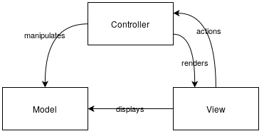

Este padrão arquitetural permite uma maior modularidade do código, facilitando a implementação de novas funcionalidades.

> Fonte: [Architectural Patterns](https://web.fe.up.pt/~arestivo/presentation/patterns/#56)

# Design Patterns

### Level Builder
#### Contexto do Problema
Era necessário encontrar uma forma de criar os níveis predefinidos, que são compostos por vários objetos. Deste modo, dependendo do nível, são inicializados diferentes objetos, evitando a existência de um construtor enorme responsável por decidir quais objetos a ser criados.

#### Padrão
Para resolver este problema, utilizamos uma adaptação do *Design Pattern* ***Builder***, usando como base o mecanismo de utilização de métodos *Build* para decidir se, em cada nível, iriamos precisar de criar ou não um determinado *ElementModel*.

#### Implementação
Ao implementar este *Design Pattern*, apercebemo-nos que a maneira mais simples de construir um nível seria a criação de uma classe única *LevelBuilder*, que iria ser capaz de ler um ficheiro `.txt` e descodificar os simbolos *ASCII*. Cada símbolo estaria associado a um elemento.

O diagrama seguinte demonstra como implementamos o *Design Pattern*.

##### Ficheiros
- [LevelController](../src/main/java/org/g70/controller/level/LevelController.java)
- [LevelBuilder](../src/main/java/org/g70/controller/level/LevelBuilder.java)
- [Level Resources](../src/main/resources/levelDesign) (Pasta que contém os níveis)

#### Consequências
- Facilita criação de novos níveis.
- Facilita alteração dos níveis atuais.
- Facilita a adição de novos *ElementModels*, sendo apenas necessário atribuir um novo símbolo ASCII.

> Fonte: [Design Patterns - Builder](https://refactoring.guru/design-patterns/builder)

###  State
#### Contexto do Problema
Como planeávamos ter um programa que fosse possuir diversos estados de jogo, os quais teriam comportamentos distintos, decidimos que era necessário arranjar um padrão para organizar o código da melhor maneira possível, que permitisse a troca entre estados.

#### Padrão
Para resolver este problema, decidimos implementar o *Design Pattern* ***State***. Este padrão possibilitou a criação de vários estados de jogo.

#### Implementação
O diagrama seguinte demonstra como implementamos o *Design Pattern*.

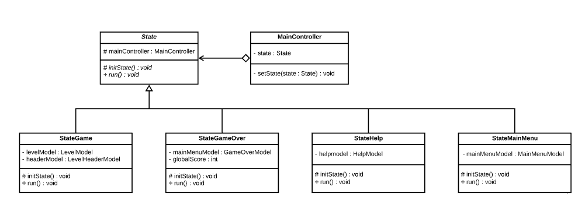

#### Ficheiros
- [Main Controller](../src/main/java/org/g70/controller/MainController.java)
- [State](../src/main/java/org/g70/controller/state/State.java)
- [StateGame](../src/main/java/org/g70/controller/state/StateGame.java)
- [StateGameOver](../src/main/java/org/g70/controller/state/StateGameOver.java)
- [StateHelp](../src/main/java/org/g70/controller/state/StateHelp.java)
- [StateMainMenu](../src/main/java/org/g70/controller/state/StateMainMenu.java)

#### Consequências
- Maior modularidade do código, facilitando não só a alteração dos estados de jogo, mas também a sua adição (*Open-Closed Principle*).
- Evita o uso de *Switch Statements* para alternar entre os diversos estados.

> Fonte: [Design Patterns - State](https://web.fe.up.pt/~arestivo/presentation/patterns/#35)

### Command
#### Contexto do Problema
Inicialmente, tinhamos apenas criado um simples menu principal capaz de iniciar ou terminar o jogo, que possuia apenas vários *Ifs* para executar a opção escolhida pelo utilizador, pelo que nos apercebemos que a contínua adição de funcionalidades aos menus iria causar o *Code Smell* *If Statements*.

#### Padrão
Para resolver este problema, decidimos que as diferentes opções existentes nos menus seriam alteradas através de comandos. Por este motivo, decidimos utilizar o *Design Pattern* ***Command***.
#### Implementação
O diagrama seguinte demonstra como implementamos o *Design Pattern*.

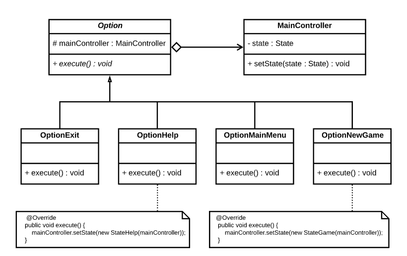

#### Ficheiros
- [Main Controller](../src/main/java/org/g70/controller/MainController.java)
- [Option](../src/main/java/org/g70/controller/menu/option/Option.java)
- [OptionExit](../src/main/java/org/g70/controller/menu/option/OptionExit.java)
- [OptionHelp](../src/main/java/org/g70/controller/menu/option/OptionHelp.java)
- [OtionMainMenu](../src/main/java/org/g70/controller/menu/option/OptionMainMenu.java)
- [OptionNewGame](../src/main/java/org/g70/controller/menu/option/OptionNewGame.java)

#### Consequências
- Facilita a adição e alteração de *Options* (*Open-Closed Principle*).
- Possibilita a criação de *Options* que afetem o estado de jogo.
- Evita o uso de *Switch Statements* para selecionar as opções.

> Fonte: [Design Patterns - Command](https://web.fe.up.pt/~arestivo/presentation/patterns/#20)

### Puffle/Box Interact Strategy
#### Problema
Sempre que o utilizador pressiona uma tecla para mover o Puffle, vão ser verificadas todas as interações com os diversos elementos presentes no jogo. Quando o Puffle colide com uma *Wall* ou com um *Teleport*, a interação vai ser diferente. A contínua adição de interações entre o objeto e o Puffle causou um *Code Smell*, devido ao elevado número de *If Statements* associados a cada interação.

Aleḿ disso, adicionamos também um novo elemento Box, que teria a sua própria interação com cada objeto, o que acentuou o *Code Smell*.

#### Padrão
Para resolver este problema, decidimos utilizar o *Design Pattern* ***Strategy***, que permitiu encapsular dinamicamente as diferentes interações de cada *ElementModel* com o Puffle e a Box em diferentes classes, alterando a interação quando necessário.

#### Implementação
O diagrama seguinte demonstra como implementamos o *Design Pattern*.

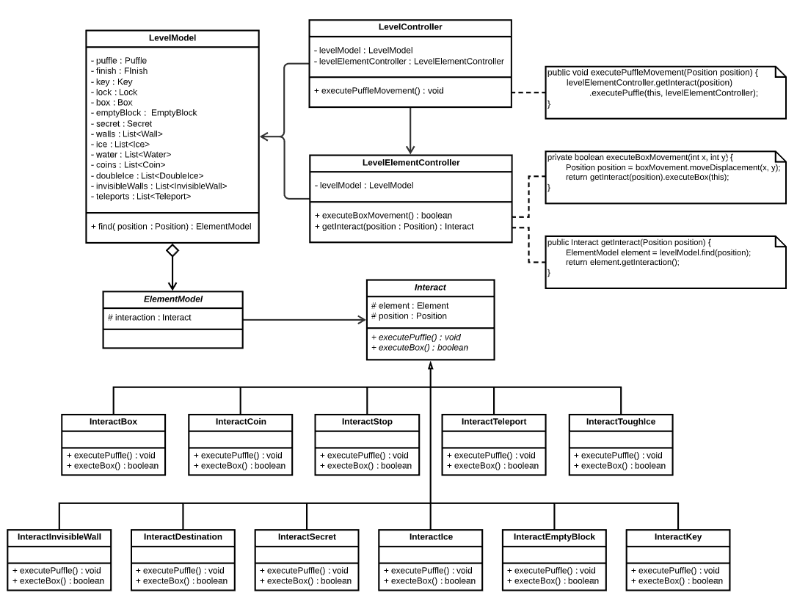

##### Ficheiros
- [LevelController](../src/main/java/org/g70/controller/level/LevelController.java)
- [LevelElementController](../src/main/java/org/g70/controller/level/LevelElementController.java)
- [LevelModel](../src/main/java/org/g70/model/level/LevelModel.java)
- [ElementModel](../src/main/java/org/g70/model/drawable/element/ElementModel.java)
- [Interact](../src/main/java/org/g70/controller/level/interact/Interact.java)
- [InteractBox](../src/main/java/org/g70/controller/level/interact/InteractBox.java)
- [InteractCoin](../src/main/java/org/g70/controller/level/interact/InteractCoin.java)
- [InteractFinish](../src/main/java/org/g70/controller/level/interact/InteractFinish.java)
- [InteractEmptyBlock](../src/main/java/org/g70/controller/level/interact/InteractEmptyBlock.java)
- [InteractIce](../src/main/java/org/g70/controller/level/interact/InteractIce.java)
- [InteractInvisibleWall](../src/main/java/org/g70/controller/level/interact/InteractInvisibleWall.java)
- [InteractKey](../src/main/java/org/g70/controller/level/interact/InteractKey.java)
- [InteractSecret](../src/main/java/org/g70/controller/level/interact/InteractSecret.java)
- [InteractStop](../src/main/java/org/g70/controller/level/interact/InteractStop.java)
- [InteractTeleport](../src/main/java/org/g70/controller/level/interact/InteractTeleport.java)
- [InteractDoubleIce](../src/main/java/org/g70/controller/level/interact/InteractDoubleIce.java)

#### Consequências
- Fácil e rápida implementação do comportamento de novos elementos.
- Evita longos *If Statements* associados ao comportamento de cada elemento.
- Permite evitar código repetido, dado que vários elementos podem ter a mesma interação. Por exemplo, a *Wall* e a *Water* possuem ambas *InteractStop*.

> Fonte: [Design Patterns - Strategy](https://web.fe.up.pt/~arestivo/presentation/patterns/#30)

### Melt Strategy

#### Problema
Ao mover o *Puffle* era necessário não só vericar as interações associadas ao bloco para qual o *Puffle* se tenta mover, mas também é necessário derreter o bloco sobre o qual se situa. Inicialmente, para implementarmos este funcionalidade, colocamos vários *if Statements* no método `movePuffle()`, originando os *Code Smells* *Long Method* e *Switch Statements*.

#### Padrão
Para resolvermos este problema, decidimos utilizar o *Design Pattern* ***Strategy***.

Este padrão permite-nos definir uma familia de algoritmos separados em diferentes classes, alterando facilmente o algoritmo que um determinado objeto usa. Deste modo, dependendo do bloco, o Puffle vai possuir um método diferente para derreter o gelo.

#### Implementação

O diagrama seguinte demonstra como implementamos o *Design Pattern*.

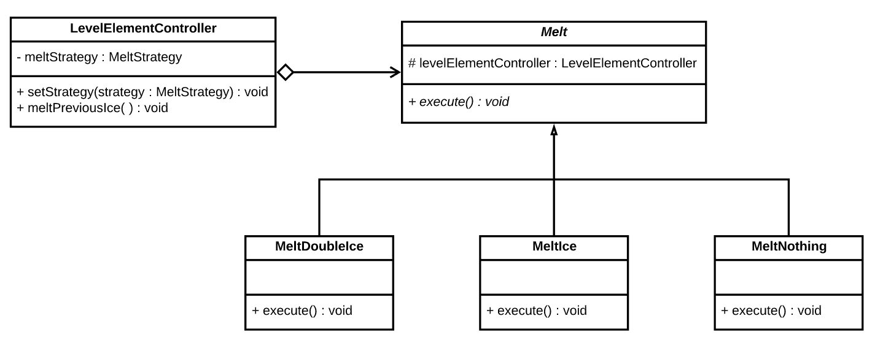

##### Ficheiros
- [Melt](../src/main/java/org/g70/controller/level/strategy/Melt.java)
- [MeltDoubleIce](../src/main/java/org/g70/controller/level/strategy/MeltDoubleIce.java)
- [MeltIce](../src/main/java/org/g70/controller/level/strategy/MeltIce.java)
- [MeltNothing](../src/main/java/org/g70/controller/level/strategy/MeltNothing.java)

#### Consequências
- Evita um código desorganizado e repleto de *if statements* confusos.
- Torna mais fácil alternar a estratégia a ser utilizada.
- O controlador deixa de verificar se existe um objeto com uma interação debaixo dela (na mesma posiçao), que maioritariamente nem iria existir, evitando erros e verificações associadas a *null pointers*.
- Facilita a adição de novos comportamentos do Puffle ao sair de uma posição.

> Fonte: [Design Patterns - Strategy](https://web.fe.up.pt/~arestivo/presentation/patterns/#30)

### Menu Factory
#### Problema
Os diferentes menus do jogo possuiam bastantes métodos e código repetido, pelo que procurámos tentar organizar as classes de modo a evitar o *Code Smell* *Duplicate Code*.

#### Padrão
Este problema foi resolvido utilizando o *Design Pattern* *Factory Method*.

Criamos a classe *Menu Factory*, que possui um *ArrayList* de *Options* e *TextBoxes*. Posteriormente, criamos vários menus que extendem a clases *MenuFactory*, e cada um adiciona a cada *ArrayList* os objetos que deseja.

#### Implementação

O diagrama seguinte demonstra como implementamos o *Design Pattern*.

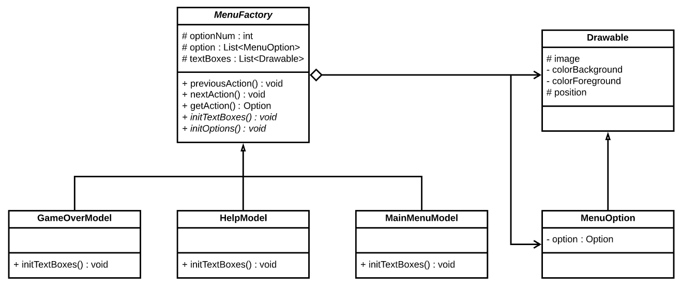

##### Ficheiros

- [Drawable](../src/main/java/org/g70/model/drawable/Drawable.java)
- [MenuOption](../src/main/java/org/g70/model/drawable/menudrawable/MenuOption.java)
- [GameOverModel](../src/main/java/org/g70/model/menu/GameOverModel.java)
- [HelpModel](../src/main/java/org/g70/model/menu/HelpModel.java)
- [MainMenuModel](../src/main/java/org/g70/model/menu/MainMenuModel.java)
- [MenuFactory](../src/main/java/org/g70/model/menu/MenuFactory.java)

#### Consequências

- Fácil criação de novos menus.
- Fácil de adicionar/remover opções a cada menu.

> Fonte: [Design Patterns - Factory Method](https://web.fe.up.pt/~arestivo/presentation/patterns/#10)

### Private Class Data

#### Problema
Uma vez que estamos a utilizar o *MVC* quase desde o ínicio deste trabalho, não tivemos problemas associados à manipulação indevida de atributos, uma vez que toda a informação sobre os dados se encontra no *Model*.

#### Padrão
Esta situação provocou a criação de algumas *Design Pattern* *Private Class Data*. Este *Design Pattern* consiste na criação de uma data class contendo todos os objetos que se deseja encapsular.

#### Implementação
O diagrama seguinte demonstra como implementamos o *Design Pattern*.

#### Consequências

- Permite controlar o acesso à informação presente no nível.
- Origina o *Code Smell* *Data Class*, que acaba por ser inerente ao padrão de arquitetura usado: *MVC*.
- Facilita a adição de *Elements* ao nível, pelo que basta adicionar mais um atributo ao levelModel.

> Fonte : [Design Patterns - Private Class Data](https://sourcemaking.com/design_patterns/private_class_data), [Private Class Data](https://en.wikipedia.org/wiki/Private_class_data_pattern)

# Code Smells and Refactoring

### Data Class

As classes que se encontram no *package* [*Model*](../src/main/java/org/g70/model) são apenas constituídas por atributos, funções *getter* e *setter*.  

Embora se possa resolver este problema colocando a *lógica do jogo* nas nossas *Data Classes* utilizando, por exemplo, o *Move Method*, estaríamos a violar o padrão arquitetural escolhido, o ***MVC***. Sendo assim, podemos afirmar que este *Code Smell* é inerente ao estilo arquitetural utilizado no desenvolvimento do nosso projeto, pelo que não temos planos futuros para o corrigir.

> Fonte: [Data Class](https://refactoring.guru/smells/data-class), [Move Method](https://refactoring.guru/move-method)

### Large Class
Embora a classe *LevelElementController* tenha pouco mais do que 100 linhas de código, possui um grande número de métodos, sendo responsável pela interações entre todos os elementos.

Uma maneira de corrigir este problema seria o uso do *Refactor* *Extract Class*, através da criação de uma classe para encapsular todos os métodos associados á manipulação de um objeto.

Por exemplo, os métodos:
- `updateBoxMovement()`
- `moveBox(Position position)`
- `resetBoxInteraction()`
- `boxLoop()`
- `executeBoxMovement()`

poderiam ser extraidos para uma nova classe, e o mesmo seria feito para cada Elemento.

> Fonte: [Large Class](https://refactoring.guru/smells/large-class), [Extract Class](https://refactoring.guru/extract-class)

### Switch Statements
A classe [*LevelController*](src/main/java/org/g70/controller/level/LevelController.java) possui o método `processCommand()`, que contém um longo ***Switch Statement*** para processar o comando escolhido pelo utilizador.

Esta situação origina o *Code Smell* ***Switch Statements***, que é problemático, pois a continua adição de comandos torna o código confuso e difícil de ler.

O problema pode ser resolvido aplicando o *Design Pattern* ***Command***, criando um objeto para cada comando.

> Fonte: [Switch Statements](https://refactoring.guru/smells/switch-statements), [Design Patterns - Command](https://web.fe.up.pt/~arestivo/presentation/patterns/#20)

# Unit Tests

A realização de *Unit Tests* permitiu-nos descobrir alguns erros que tinhamos no nosso código e que, muito provavelmente, de outra maneira, não os iriamos encontrar.

A utilização de mutation tests, além de verificar se estavamos a testar de forma correta os diversos métodos e classes, permitiu-nos descobrir linhas de código que eram redundantes. Por exemplo, tínhamos uma mutation que removia um *setInteraction*. Não obstante, esse set era redundante uma vez que era executado duas vezes, pelo que não tinha qualquer efeito no código.

Ao longo do desenvolvimento destes mesmos testes, fomos descobrindo que não servem apenas para corrigir erros no código, mas também ajudam a promover um melhor desenvolvimento do mesmo.

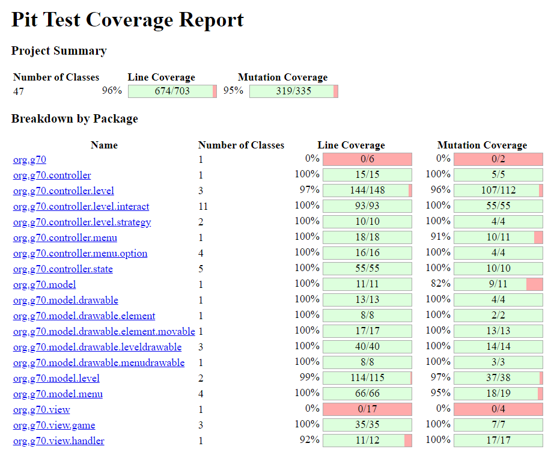

Os resultados dos testes encontram-se na seguinte [pasta](./testing), encontrando-se também hospedados na seguinte [página](https://tests-lpoo-g70.surge.sh/).

# Auto-avaliação

Ambos os membros do grupo contribuiram de igual forma, tendo cada feito um enorme trabalho ao longo destes meses, permitindo o desenvolvimento deste projeto.

Divisão percentual do trabalho:
- **Diogo Samuel Fernandes** - 50%
- **Hugo Guimarães** - 50%
